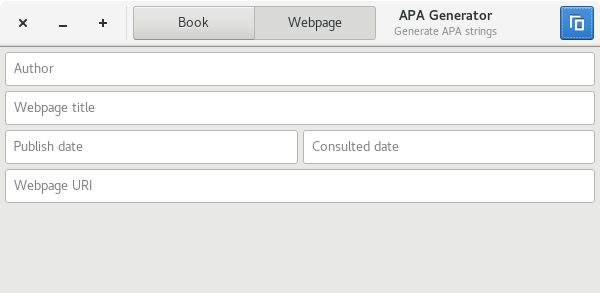

# APA Generator

Application to create APA sources to include in your reports.

## Screenshots




## What can I do with it?

You can easily create an APA source for a book or webpage by simply
filling in the fields.

## Required packages

### Building

- gtk3-devel
- automake

### Installing

- gtk3

## Features

- Create APA source for a book
- Create APA source for a webpage
- Change APA string for both the book and the webpage

## How to build

```
$ autoreconf -vi
$ ./configure
$ make install
```

And then run `apagenerator`

## Generate RPM package

You first need to download the latest
release of APA generator using spectool.

```
$ cd packaging/RPM
$ spectool -g apagenerator.spec
$ fedpkg --release f26 local
```

This will create a RPM file which you can install using your package manager.

## COPR

If you have Fedora and don't want to build APA Generator from source you can easily install it using dnf copr.

```
sudo dnf copr enable bartkessels/apagenerator
sudo dnf install apagenerator
```
